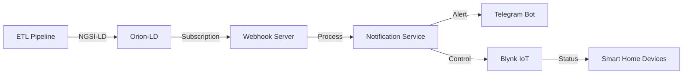

# 🌤️ Air Track Quality Notification System

> **Real-time environmental monitoring and smart home automation using NGSI-LD, Telegram Bot, and Blynk IoT**

[](https://opensource.org/licenses/Apache-2.0)
[](https://www.python.org/)
[](https://www.etsi.org/deliver/etsi_gs/CIM/001_099/009/01.08.01_60/gs_cim009v010801p.pdf)

## 📖 Overview

An intelligent notification and control system that automatically monitors air quality, weather, and automatically controls smart home IoT devices via Telegram Bot.

### ✨ Key Features

  - 🚀 **Real-time Alerts**: Immediate alerts when new data arrives (no delay)
  - 🌫️ **Air Quality Monitoring**: Monitors AQI, PM2.5, PM10, CO, NO2, O3, SO2
  - 🌡️ **Weather Tracking**: Temperature, humidity, rainfall, wind speed
  - 🤖 **Smart Home Control**: Automatically controls air purifiers, irrigation, heaters, and AC
  - 📱 **Telegram Integration**: Receive notifications and control via Telegram Bot
  - ⚡ **Event-Driven**: Uses Orion-LD subscriptions for high performance

-----

## 🏗️ System Architecture



### 📂 Directory Structure

```
BlynkNotification/
├── config/
│   ├── .env.blynk           # Main configuration
│   └── .env.blynk.example   # Configuration template
├── services/
│   └── notification_service.py  # Main service
├── simulator/
│   └── device_simulator.py      # IoT device simulator
├── setup_orion_subscriptions.py # Setup Orion-LD
└── README.md
```

-----

## 🚀 Quick Installation

### 1\. System Requirements

  - **Python**: 3.8+
  - **Docker**: Orion-LD and QuantumLeap running
  - **Blynk Account**: Template with 4 Virtual Pins (V1-V4)
  - **Telegram Bot**: Token from [@BotFather](https://t.me/botfather)

### 2\. Install Dependencies

```bash
cd D:\air-track-ngsi-ld
pip install -r requirements.txt
```

**requirements.txt:**

```txt
python-telegram-bot==20.6
flask==3.0.0
requests==2.31.0
python-dotenv==1.0.0
```

### 3\. Configuration

Create file `config/.env.blynk` from `config/.env.blynk.example`:

```bash
copy .env.blynk.example .env.blynk
```

### 4\. Setup Orion-LD Subscriptions

```bash
python setup_orion_subscriptions.py
```

**Output:**

```
✅ Testing webhook connectivity...
✅ Creating weather subscription...
✅ Creating air quality subscription...
🎉 Setup complete!
```

-----

## 🎮 Usage

### Start Notification Service

```bash
cd D:\air-track-ngsi-ld\BlynkNotification
python services\notification_service.py
```

**Output:**

```
🚀 Event-driven notification service started
📡 Webhook listening on http://0.0.0.0:4999
⚡ Real-time alerts: ENABLED
✅ Event loop initialized and ready
```

### Telegram Bot Commands

| Command | Description |
|---------|-------|
| `/start` | Welcome and instructions |
| `/subscribe` | Subscribe to notifications |
| `/settings` | Configure settings |

### Demo Device Simulator (Optional)

```bash
cd D:\air-track-ngsi-ld\BlynkNotification\simulator
python device_simulator.py
```

Select option:

1.  **Continuous monitoring** - Monitor continuously
2.  **Manual control demo** - Manual control test

-----

## 🔔 Alert Rules

### Alert Conditions

| Alert Type | Condition | Device Action | Cooldown |
|------------|-----------|---------------|----------|
| **HIGH\_AQI** | `aqi >= 3` | Turn on air purifier | 2 mins |
| **HIGH\_PM25** | `pm25 >= 55.5 µg/m³` | Turn on air purifier | 2 mins |
| **HIGH\_HUMIDITY** | `humidity >= 85%` | Turn off irrigation | 2 mins |
| **LOW\_TEMPERATURE** | `temperature <= 15°C` | Turn on heater | 2 mins |
| **HEAVY\_RAIN** | `precipitation >= 5 mm/h` | Turn off irrigation | 2 mins |

### Alert Example

```
🚨 ALERT: Poor air quality!

📍 Area: PhuongHoanKiem
🌫️ AQI: 52 (Moderate)
💨 PM2.5: 92.43 µg/m³
⏰ Time: 14:30 16/11/2025

💡 Recommendation: Turn on air purifier!

[✅ Accept]  [❌ Decline]
```

-----

## 🔧 Blynk IoT Setup

### Virtual Pins

| Pin | Device | Function |
|-----|--------|----------|
| **V1** | Air Purifier | ON/OFF (1/0) |
| **V2** | Irrigation | ON/OFF (1/0) |
| **V3** | Heater | ON/OFF (1/0) |
| **V4** | AC | ON/OFF (1/0) |

### Blynk Template Setup

1.  Create **New Template** on [Blynk Console](https://blynk.cloud/)
2.  Add 4 **Switch Widgets** (V1-V4)
3.  Copy **Auth Token** into `.env.blynk`

-----

## 🧪 Testing

### 1\. Test Webhook

```bash
curl http://localhost:4999/health
```

**Response:**

```json
{
  "status": "healthy",
  "subscriptions": 1,
  "loop_running": true,
  "timestamp": "2025-11-16T14:30:00"
}
```

### 2\. Test Orion-LD Subscriptions

```bash
curl http://localhost:1026/ngsi-ld/v1/subscriptions \
  -H "NGSILD-Tenant: hanoi"
```

### 3\. Test Blynk Control

```python
import requests

BLYNK_TOKEN = "your_token_here"

# Turn on air purifier
requests.get(
    "https://blynk.cloud/external/api/update",
    params={"token": BLYNK_TOKEN, "pin": "V1", "value": 1}
)
```

-----

## 📊 Operation Flow

### Event-Driven Flow

```
1. ETL Pipeline updates new data
   ↓
2. Orion-LD receives entity update
   ↓
3. Orion-LD triggers subscription
   ↓
4. Webhook calls notification service
   ↓
5. Service checks alert conditions
   ↓
6. Send Telegram notification
   ↓
7. User confirms → Control Blynk IoT
```

### Smart Control Logic

```python
# Example: If AQI is high → Turn on air purifier
if aqi >= 3:
    # Check if machine is already on
    current_state = blynk.get_device_state("V1")
    
    if current_state == 0:  # Currently OFF
        # Send alert + buttons
        await send_alert_with_buttons()
    else:  # Already ON
        # Just notify
        await send_info_message("Air purifier is already on")
```

### Cooldown Mechanism

```python
# Avoid notification spam
cooldown_key = f"{chat_id}_{alert_type}_{district}"

if cooldown_key in cooldowns:
    time_remaining = cooldown_time - (now - last_alert)
    
    if time_remaining > 0:
        skip_alert()  # Skip during cooldown period
```

-----

## 🐛 Troubleshooting

### Common Issues

#### 1\. Not receiving notifications

**Cause:**

  - District mismatch
  - Data hasn't reached alert threshold
  - Currently in cooldown

**Solution:**

```bash
# Check log
python services\notification_service.py

# View entity ID in Orion-LD
curl http://localhost:1026/ngsi-ld/v1/entities?type=airQualityObserved \
  -H "NGSILD-Tenant: hanoi"

# Lower threshold to test
# In notification_service.py line 253:
condition="aqi >= 3"  # Instead of >= 150
```

#### 2\. Webhook error 500

**Cause:** Event loop not ready

**Solution:** Wait for log `✅ Event loop initialized and ready` before running ETL

#### 3\. Blynk control failed

**Check:**

```bash
# Test manual
curl "https://blynk.cloud/external/api/get?token=YOUR_TOKEN&pin=V1"
```

-----

## 📝 Logs

### Log Levels

  - **INFO**: Normal operation
  - **WARNING**: Non-critical warning
  - **ERROR**: Error requiring fix

### Log Examples

```
2025-11-16 14:30:05 - INFO - 📥 Received air quality notification
2025-11-16 14:30:05 - INFO - 🌫️ Processing air quality data for PhuongHoanKiem
2025-11-16 14:30:05 - INFO -    👤 User 123456789: subscribed to 'PhuongHoanKiem', active=True
2025-11-16 14:30:05 - INFO -       ✅ User 123456789 matched! Checking alert rules...
2025-11-16 14:30:05 - INFO -          🔍 Checking: aqi >= 3
2025-11-16 14:30:05 - INFO -          ✅ Condition met: high_aqi
2025-11-16 14:30:05 - INFO -          🔒 Device air_purifier_on marked as checked
```

-----

### Code Style

  - **PEP 8** compliance
  - **Type hints** for functions
  - **Docstrings** for classes and methods

-----

## 📄 License

```
Licensed under the Apache License, Version 2.0
Copyright (C) 2025 CHK. All rights reserved
```

-----

## 👥 Authors

  - **TT** - [trungthanhcva2206@gmail.com](mailto:trungthanhcva2206@gmail.com)
  - **Tankchoi** - [tadzltv22082004@gmail.com](mailto:tadzltv22082004@gmail.com)
  - **Panh** - [panh812004.apn@gmail.com](mailto:panh812004.apn@gmail.com)

-----

## 🔗 Links

  - **GitHub**: [air-track-ngsi-ld](https://www.google.com/search?q=https://github.com/trungthanhcva2206/air-track-ngsi-ld/BlynkNotification)
  - **Blynk**: [blynk.io](https://blynk.io/)
  - **NGSI-LD**: [ETSI Spec](https://www.etsi.org/deliver/etsi_gs/CIM/001_099/009/01.08.01_60/gs_cim009v010801p.pdf)
  - **Telegram Bots**: [@BotFather](https://t.me/botfather)

-----

## 💡 Support

If you encounter issues, please:

1.  Check [Issues](https://www.google.com/search?q=https://github.com/trungthanhcva2206/air-track-ngsi-ld/issues)
2.  View [Documentation Wiki](https://www.google.com/search?q=https://github.com/trungthanhcva2206/air-track-ngsi-ld/wiki)
3.  Discuss in [Discussions](https://www.google.com/search?q=https://github.com/trungthanhcva2206/air-track-ngsi-ld/discussions)
4.  Contact authors
