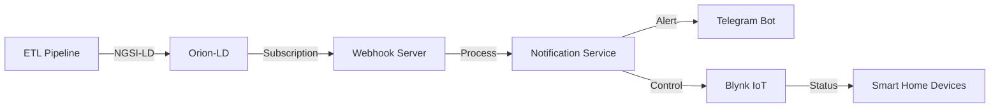

# 🌤️ Smart Air Quality Notification System

> **Real-time environmental monitoring and smart home automation using NGSI-LD, Telegram Bot, and Blynk IoT**

[](https://opensource.org/licenses/Apache-2.0)
[](https://www.python.org/)
[](https://www.etsi.org/deliver/etsi_gs/CIM/001_099/009/01.08.01_60/gs_cim009v010801p.pdf)

## 📖 Tổng Quan

Hệ thống thông báo và điều khiển thông minh tự động theo dõi chất lượng không khí, thời tiết và tự động điều khiển các thiết bị IoT trong nhà thông qua Telegram Bot.

### ✨ Tính Năng Chính

- 🚀 **Real-time Alerts**: Cảnh báo ngay lập tức khi có dữ liệu mới (không delay)
- 🌫️ **Air Quality Monitoring**: Theo dõi AQI, PM2.5, PM10, CO, NO2, O3, SO2
- 🌡️ **Weather Tracking**: Nhiệt độ, độ ẩm, lượng mưa, tốc độ gió
- 🤖 **Smart Home Control**: Điều khiển tự động máy lọc không khí, tưới cây, sưởi, điều hòa
- 📱 **Telegram Integration**: Nhận thông báo và điều khiển qua Telegram Bot
- ⚡ **Event-Driven**: Sử dụng Orion-LD subscriptions cho hiệu suất cao

---

## 🏗️ Kiến Trúc Hệ Thống



### 📂 Cấu Trúc Thư Mục

```
BlynkNotification/
├── config/
│   ├── .env.blynk           # Cấu hình chính
│   └── .env.blynk.example   # Template cấu hình
├── services/
│   └── notification_service.py  # Service chính
├── simulator/
│   └── device_simulator.py      # Giả lập thiết bị IoT
├── setup_orion_subscriptions.py # Setup Orion-LD
└── README.md
```

---

## 🚀 Cài Đặt Nhanh

### 1. Yêu Cầu Hệ Thống

- **Python**: 3.8+
- **Docker**: Orion-LD và QuantumLeap đang chạy
- **Blynk Account**: Template với 4 Virtual Pins (V1-V4)
- **Telegram Bot**: Token từ [@BotFather](https://t.me/botfather)

### 2. Cài Đặt Dependencies

```bash
cd D:\smart-air-ngsi-ld
pip install -r requirements.txt
```

**requirements.txt:**
```txt
python-telegram-bot==20.6
flask==3.0.0
requests==2.31.0
python-dotenv==1.0.0
```

### 3. Cấu Hình

Tạo file `config/.env.blynk` từ `config/.env.blynk.example`:

```bash
copy .env.blynk.example .env.blynk
```

### 4. Setup Orion-LD Subscriptions

```bash
python setup_orion_subscriptions.py
```

**Output:**
```
✅ Testing webhook connectivity...
✅ Creating weather subscription...
✅ Creating air quality subscription...
🎉 Setup complete!
```

---

## 🎮 Sử Dụng

### Khởi Động Notification Service

```bash
cd D:\smart-air-ngsi-ld\BlynkNotification
python services\notification_service.py
```

**Output:**
```
🚀 Event-driven notification service started
📡 Webhook listening on http://0.0.0.0:4999
⚡ Real-time alerts: ENABLED
✅ Event loop initialized and ready
```

### Telegram Bot Commands

| Command | Mô Tả |
|---------|-------|
| `/start` | Chào mừng và hướng dẫn |
| `/subscribe` | Đăng ký nhận thông báo |
| `/settings` | Cài đặt tùy chọn |

### Demo Device Simulator (Optional)

```bash
cd D:\smart-air-ngsi-ld\BlynkNotification\simulator
python device_simulator.py
```

Chọn option:
1. **Continuous monitoring** - Giám sát liên tục
2. **Manual control demo** - Test điều khiển thủ công

---

## 🔔 Alert Rules

### Điều Kiện Cảnh Báo

| Alert Type | Điều Kiện | Device Action | Cooldown |
|------------|-----------|---------------|----------|
| **HIGH_AQI** | `aqi >= 3` | Bật máy lọc không khí | 2 phút |
| **HIGH_PM25** | `pm25 >= 55.5 µg/m³` | Bật máy lọc không khí | 2 phút |
| **HIGH_HUMIDITY** | `humidity >= 85%` | Tắt tưới cây | 2 phút |
| **LOW_TEMPERATURE** | `temperature <= 15°C` | Bật máy sưởi | 2 phút |
| **HEAVY_RAIN** | `precipitation >= 5 mm/h` | Tắt tưới cây | 2 phút |

### Ví Dụ Alert

```
🚨 CẢNH BÁO: Chất lượng không khí kém!

📍 Khu vực: PhuongHoanKiem
🌫️ AQI: 52 (Moderate)
💨 PM2.5: 92.43 µg/m³
⏰ Thời gian: 14:30 16/11/2025

💡 Khuyến nghị: Bật máy lọc không khí!

[✅ Đồng ý]  [❌ Từ chối]
```

---

## 🔧 Blynk IoT Setup

### Virtual Pins

| Pin | Device | Function |
|-----|--------|----------|
| **V1** | Air Purifier | ON/OFF (1/0) |
| **V2** | Irrigation | ON/OFF (1/0) |
| **V3** | Heater | ON/OFF (1/0) |
| **V4** | AC | ON/OFF (1/0) |

### Blynk Template Setup

1. Tạo **New Template** trên [Blynk Console](https://blynk.cloud/)
2. Thêm 4 **Switch Widgets** (V1-V4)
3. Copy **Auth Token** vào `.env.blynk`

---

## 🧪 Testing

### 1. Test Webhook

```bash
curl http://localhost:4999/health
```

**Response:**
```json
{
  "status": "healthy",
  "subscriptions": 1,
  "loop_running": true,
  "timestamp": "2025-11-16T14:30:00"
}
```

### 2. Test Orion-LD Subscriptions

```bash
curl http://localhost:1026/ngsi-ld/v1/subscriptions \
  -H "NGSILD-Tenant: hanoi"
```

### 3. Test Blynk Control

```python
import requests

BLYNK_TOKEN = "your_token_here"

# Bật máy lọc không khí
requests.get(
    "https://blynk.cloud/external/api/update",
    params={"token": BLYNK_TOKEN, "pin": "V1", "value": 1}
)
```

---

## 📊 Luồng Hoạt Động

### Event-Driven Flow

```
1. ETL Pipeline cập nhật dữ liệu mới
   ↓
2. Orion-LD nhận entity update
   ↓
3. Orion-LD trigger subscription
   ↓
4. Webhook gọi notification service
   ↓
5. Service kiểm tra alert conditions
   ↓
6. Gửi thông báo Telegram
   ↓
7. User xác nhận → Điều khiển Blynk IoT
```

### Smart Control Logic

```python
# Ví dụ: Nếu AQI cao → Bật máy lọc không khí
if aqi >= 3:
    # Kiểm tra máy đã bật chưa
    current_state = blynk.get_device_state("V1")
    
    if current_state == 0:  # Đang TẮT
        # Gửi thông báo + nút bấm
        await send_alert_with_buttons()
    else:  # Đã BẬT
        # Chỉ thông báo
        await send_info_message("Máy lọc đã bật sẵn")
```

### Cooldown Mechanism

```python
# Tránh spam thông báo
cooldown_key = f"{chat_id}_{alert_type}_{district}"

if cooldown_key in cooldowns:
    time_remaining = cooldown_time - (now - last_alert)
    
    if time_remaining > 0:
        skip_alert()  # Bỏ qua trong thời gian cooldown
```

---

## 🐛 Troubleshooting

### Vấn Đề Thường Gặp

#### 1. Không nhận được thông báo

**Nguyên nhân:**
- District không khớp
- Dữ liệu chưa đạt ngưỡng cảnh báo
- Đang trong cooldown

**Giải pháp:**
```bash
# Kiểm tra log
python services\notification_service.py

# Xem entity ID trong Orion-LD
curl http://localhost:1026/ngsi-ld/v1/entities?type=airQualityObserved \
  -H "NGSILD-Tenant: hanoi"

# Giảm ngưỡng để test
# Trong notification_service.py line 253:
condition="aqi >= 3"  # Thay vì >= 150
```

#### 2. Webhook lỗi 500

**Nguyên nhân:** Event loop chưa sẵn sàng

**Giải pháp:** Đợi log `✅ Event loop initialized and ready` trước khi chạy ETL

#### 3. Blynk control thất bại

**Kiểm tra:**
```bash
# Test manual
curl "https://blynk.cloud/external/api/get?token=YOUR_TOKEN&pin=V1"
```

---

## 📝 Logs

### Log Levels

- **INFO**: Hoạt động bình thường
- **WARNING**: Cảnh báo không nghiêm trọng
- **ERROR**: Lỗi cần khắc phục

### Log Examples

```
2025-11-16 14:30:05 - INFO - 📥 Received air quality notification
2025-11-16 14:30:05 - INFO - 🌫️ Processing air quality data for PhuongHoanKiem
2025-11-16 14:30:05 - INFO -    👤 User 123456789: subscribed to 'PhuongHoanKiem', active=True
2025-11-16 14:30:05 - INFO -       ✅ User 123456789 matched! Checking alert rules...
2025-11-16 14:30:05 - INFO -          🔍 Checking: aqi >= 3
2025-11-16 14:30:05 - INFO -          ✅ Condition met: high_aqi
2025-11-16 14:30:05 - INFO -          🔒 Device air_purifier_on marked as checked
```

---


### Code Style

- **PEP 8** compliance
- **Type hints** cho functions
- **Docstrings** cho classes và methods

---

## 📄 License

```
Licensed under the Apache License, Version 2.0
Copyright (C) 2025 CHK. All rights reserved
```

---

## 👥 Authors

- **TT** - [trungthanhcva2206@gmail.com](mailto:trungthanhcva2206@gmail.com)
- **Tankchoi** - [tadzltv22082004@gmail.com](mailto:tadzltv22082004@gmail.com)
- **Panh** - [panh812004.apn@gmail.com](mailto:panh812004.apn@gmail.com)

---

## 🔗 Links

- **GitHub**: [smart-air-ngsi-ld](https://github.com/trungthanhcva2206/smart-air-ngsi-ld/BlynkNotification)
- **Blynk**: [blynk.io](https://blynk.io/)
- **NGSI-LD**: [ETSI Spec](https://www.etsi.org/deliver/etsi_gs/CIM/001_099/009/01.08.01_60/gs_cim009v010801p.pdf)
- **Telegram Bots**: [@BotFather](https://t.me/botfather)

---

## 💡 Support

Nếu gặp vấn đề, vui lòng:

1. Xem [Issues](https://github.com/trungthanhcva2206/smart-air-ngsi-ld/issues)
2. Xem [Documentation Wiki](https://github.com/trungthanhcva2206/smart-air-ngsi-ld/wiki)
3. Trao đổi [Discussions](https://github.com/trungthanhcva2206/smart-air-ngsi-ld/discussions)
4. Liên hệ authors

