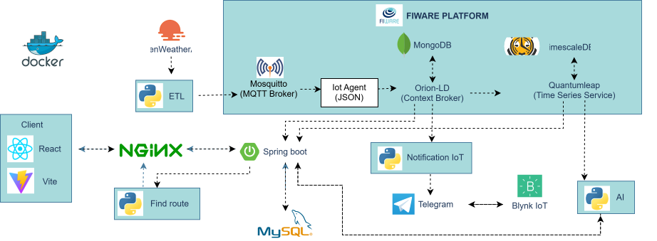

# Air Track NGSI-LD

[](https://opensource.org/licenses/Apache-2.0)
[](https://www.etsi.org/deliver/etsi_gs/CIM/001_099/009/01.08.01_60/gs_cim009v010801p.pdf)

Air quality data monitoring and management system based on NGSI-LD and Linked Data.

## 📋 Table of Contents

- [Introduction](#-introduction)
- [System Architecture](#-system-architecture)
- [Features](#-features)
- [System Requirements](#-system-requirements)
- [Quick Setup](#-quick-setup)
- [Detailed Setup](#-detailed-setup)
- [Technologies Used](#-technologies-used)
- [Changelog](#-changelog)
- [Contribution](#-contribution)
- [License](#-license)
- [Contact](#-contact)

## 🌟 Introduction

Air Track NGSI-LD is a comprehensive solution for collecting, storing, and analyzing air quality data according to the **NGSI-LD** (Next Generation Service Interfaces - Linked Data) standard. The system supports monitoring the following parameters:

**Air Quality:**

  - 🌫️ PM2.5 and PM10 (Fine particulate matter)
  - 💨 CO, NO, NO₂, NOₓ, O₃, SO₂, NH₃ (Pollutant gases)
  - 📊 AQI (Air Quality Index)

**Weather:**

  - 🌡️ Temperature and Feels-like temperature
  - 💧 Humidity
  - 🌬️ Wind speed and direction
  - 🌧️ Rainfall
  - ☁️ Cloudiness, Visibility
  - 🔆 Illuminance
  - ⏲️ Atmospheric pressure

Data is modeled according to the **SOSA/SSN** (Sensor, Observation, Sample, and Actuator / Semantic Sensor Network) ontology standard, ensuring high compatibility and scalability.

## 🏗️ System Architecture



## 🛠️ Technologies Used

### Core Technologies

  - **NGSI-LD**: Context Information Management API
  - **JSON-LD**: Linked Data format
  - **SOSA/SSN Ontology**: Sensor network ontology

### Infrastructure

  - **Docker & Docker Compose**: Container orchestration
  - **MongoDB**: Document database for Orion-LD and IoT Agent
  - **TimescaleDB**: Time-series database optimized for time-series data
  - **Redis**: Caching layer for QuantumLeap

### FIWARE Components

  - **Orion-LD Context Broker**:
      - NGSI-LD API endpoint for entity management
      - Real-time context data storage and subscription
      - Multi-tenancy support (tenant: `hanoi`)
      - Integration with MongoDB backend
  - **IoT Agent JSON**:
      - Protocol translation MQTT ↔ NGSI-LD
      - Device provisioning and attribute mapping
      - Southbound: MQTT protocol via Mosquitto
      - Northbound: NGSI-LD entities to Orion-LD
  - **Eclipse Mosquitto**:
      - MQTT Broker for IoT devices (ESP32)
      - Supports MQTT protocol (port 1883) and WebSocket (port 9001)
      - Allows anonymous connections for development
  - **QuantumLeap**:
      - Time-series data API based on FIWARE standards
      - Automatic subscription to Orion-LD notifications
      - Storage backend: TimescaleDB with Redis caching
      - RESTful API for historical data queries

### Backend

  - **Python**:
      - ETL pipeline processing OpenWeather API data
      - MQTT publisher sending data to IoT Agent
      - NGSI-LD entity creation following SOSA/SSN standards
      - Data transformation and validation
  - **Spring Boot**:
      - RESTful API endpoints (Platform, Weather, Air Quality history)
      - JWT Authentication & Authorization
      - Email notification service for air quality alerts
      - SSE (Server-Sent Events) for real-time data streaming
      - Integration with FIWARE Orion-LD Context Broker
      - Integration with QuantumLeap for time-series data

### Frontend
- **React 19**: UI framework with Hooks
- **Vite 7**: Build tool and dev server
- **React Router v7**: Client-side routing
- **Redux Toolkit**: State management
- **Redux Persist**: Persistent authentication state
- **React Hook Form**: Form validation
- **React Leaflet + MapLibre GL**: Interactive maps
- **Recharts**: Data visualization
- **React Toastify**: Real-time notifications
- **Axios**: HTTP client with interceptors
- **Bootstrap 5 + SCSS**: Styling framework

## ✨ Features

  - **Real-time Data Collection**: Streaming data from physical sensors (ESP32) and open APIs (OpenWeather).
  - **NGSI-LD Standardization**: ETL pipeline transforms raw data to NGSI-LD following FIWARE standards.
  - **Entity Management**: CRUD operations for Platform, Device, WeatherObserved, AirQualityObserved.
  - **Time Series Storage**: QuantumLeap + TimescaleDB optimized for historical data.
  - **Visual Dashboard**: Real-time SSE streaming, interactive charts, air quality alerts.
  - **Optimal Routing**: A\* routing algorithm to avoid high pollution zones.
  - **Open Data Gateway**: OpenAPI 3.0 endpoints.

## 💻 System Requirements

  - Docker (\>= 20.10)
  - Docker Compose (\>= 2.0)
  - RAM: Minimum 4GB (8GB recommended)
  - Disk: Minimum 10GB free space
  - OS: Linux, macOS, Windows with WSL2

## 🚀 Quick Setup

### 1\. Clone repository

```bash
git clone https://github.com/trungthanhcva2206/smart-air-ngsi-ld.git
cd smart-air-ngsi-ld
```

### 2\. Configure environment

```bash
# Copy example environment file
cp .env.example .env

# Edit environment variables if needed
nano .env
```

### 3\. Start the system

```bash
# Build and start all services
docker-compose up -d --build

# Check status
docker-compose ps
```

### 4\. Access the application

| Service | Purpose | Host URL / Conn. (host:container) |
|---|---:|---|
| Frontend (production) | Nginx serving built SPA (Docker) | http://localhost (80:80) |
| Frontend (dev / local) | Vite dev server (if running locally) | http://localhost:5137 (dev:5137) |
| Backend API (Spring Boot) | REST API / SSE | http://localhost:8123 (8123:8123) |
| NGSI‑LD Broker (Orion‑LD) | Context Broker | http://localhost:1026 (1026:1026) |
| Route‑Finding service (Flask) | Routing & env-aware routes | http://localhost:5000 (5000:5000) |
| QuantumLeap | Time-series API | http://localhost:8668 (8668:8668) |
| Grafana | Dashboards | http://localhost:3000 (3000:3000) |
| MongoDB (Orion / IoT Agent) | Document DB | mongodb://localhost:27017 (27017:27017) |
| MySQL (Backend) | Relational DB | mysql://localhost:3306 (3306:3306) |
| TimescaleDB (Postgres) | Time-series storage | postgres://localhost:5432 (5432:5432) |
| Redis (QuantumLeap cache) | Cache | redis://localhost:6379 (6379:6379) |
| MQTT Broker (Mosquitto) | MQTT (devices) | mqtt://localhost:1883 (1883:1883) |
| MQTT WebSocket | MQTT over WS (web) | ws://localhost:9001 (9001:9001) |

## 📖 Detailed Setup

Each component has its own detailed installation guide:

### ETL Pipeline

Extract-Transform-Load system for processing sensor data.

👉 [View ETL Setup Guide](./etl/README.md)

### ByLink Integration

Integration with the ByLink system for data collection.

👉 [View ByLink Setup Guide](./BlynkNotification/README.md)

### Backend API

RESTful API server handling business logic.

👉 [View Backend Setup Guide](./backend/README.md)

### Frontend Dashboard

Web interface for data visualization and management.

👉 [View Frontend Setup Guide](./frontend/README.md)

### Routefinding Service

Optimal route finding service based on air quality.

👉 [View Routefinding Setup Guide](./route-finding/README.md)

## 📝 Changelog

### View versions and updates

To track changes, updates, and improvements in each project version:

👉 **[View CHANGELOG.md](./CHANGELOG.md)**

The CHANGELOG includes:

  - ✨ New Features
  - 🐛 Bug Fixes
  - 🔧 Improvements
  - 💥 Breaking Changes
  - 📚 Documentation updates
  - 🔒 Security updates

### Current Version

Check the current system version:

```bash
# View version from git tag
git describe --tags --abbrev=0

# Or check from package.json
cat package.json | grep version
```

### Update to new version

```bash
# Pull latest code
git pull origin main

# Check changes in CHANGELOG
cat CHANGELOG.md

# Rebuild and restart services
docker-compose down
docker-compose up -d --build
```

### Track Releases

  - View all [Releases](https://github.com/trungthanhcva2206/smart-air-ngsi-ld/releases)
  - Follow [Tags](https://github.com/trungthanhcva2206/smart-air-ngsi-ld/tags)
  - Subscribe for new release notifications

## 🤝 Contribution

We always welcome contributions from the community\!

Please read [CONTRIBUTING.md](./CONTRIBUTING.md) for details on the contribution process, coding conventions, and development guidelines.

## 📄 License

### Code License

This project is released under the **Apache License 2.0**.

See the [LICENSE](./LICENSE) file for more details.

### Data License

Data in this project is released under the **Open Data Commons – Open Database License (ODbL) v1.0**.

[](https://opendatacommons.org/licenses/odbl/1.0/)

This means you are free to:

  - **Share**: To copy, distribute and use the database.
  - **Create**: To produce works from the database.
  - **Adapt**: To modify, transform and build upon the database.

Under the following conditions:

  - **Attribution**: You must attribute any public use of the database, or works produced from the database, in the manner specified in the ODbL.
  - **Share-Alike**: If you publicly use any adapted version of this database, or works produced from an adapted database, you must also offer that adapted database under the ODbL.
  - **Keep open**: If you redistribute the database, or an adapted version of it, then you may not use technical measures that restrict the work.

See [ODbL-1.0 Full Text](https://opendatacommons.org/licenses/odbl/1.0/) for full details.

## 📧 Contact

### Team Members

  - **Trung Thanh**

      - Email: [trungthanhcva2206@gmail.com](mailto:trungthanhcva2206@gmail.com)
      - GitHub: [@trungthanhcva2206](https://github.com/trungthanhcva2206)

  - **Tankchoi**
      - Email: [tadzltv22082004@gmail.com](mailto:tadzltv22082004@gmail.com)
      - Github: [@tankchoi](https://github.com/tankchoi)

  - **Panh**

      - Email: [panh812004.apn@gmail.com](mailto:panh812004.apn@gmail.com)
      - Github: [@ntpa812](https://github.com/ntpa812)

### Bug Reports and Suggestions

  - Use [GitHub Issues](https://github.com/trungthanhcva2206/smart-air-ngsi-ld/issues) to report bugs.
  - Join [Discussions](https://github.com/trungthanhcva2206/smart-air-ngsi-ld/discussions) to chat.
  - To learn more about the system, view the full documentation on Wiki: [View Wiki Documentation](https://github.com/trungthanhcva2206/smart-air-ngsi-ld/wiki)

-----

Made with ❤️ by Air Track Team

[Back to top ↑](#-introduction)

